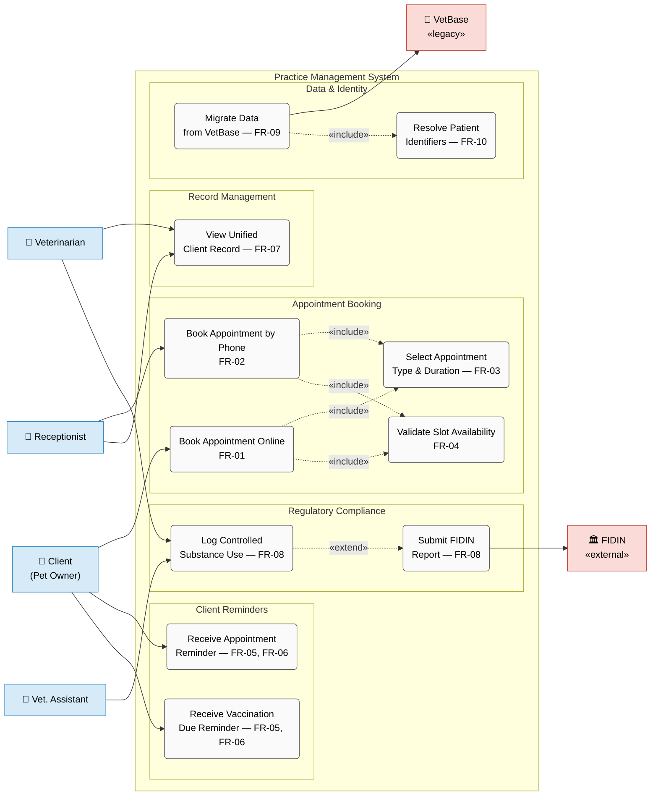
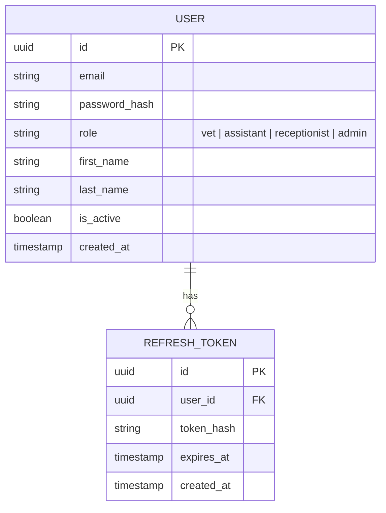
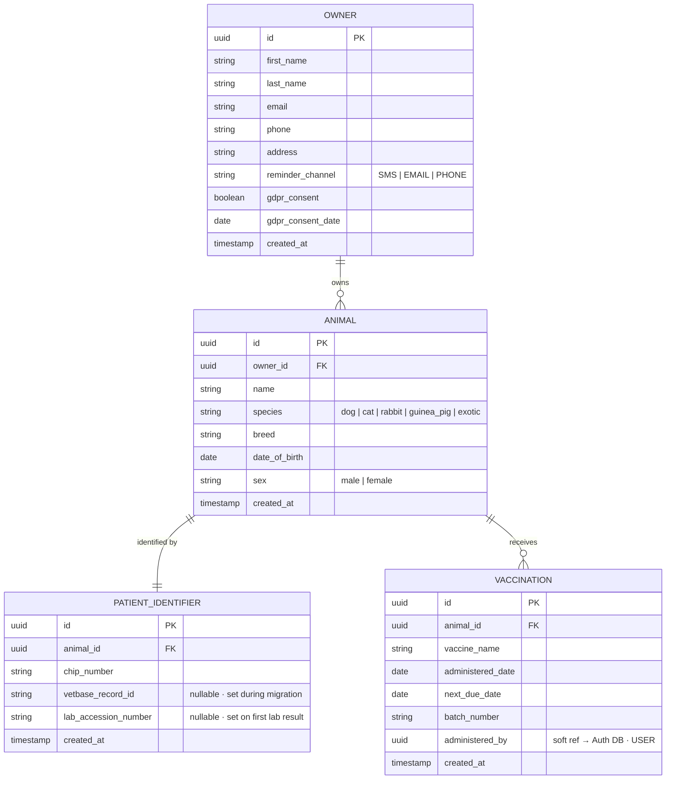
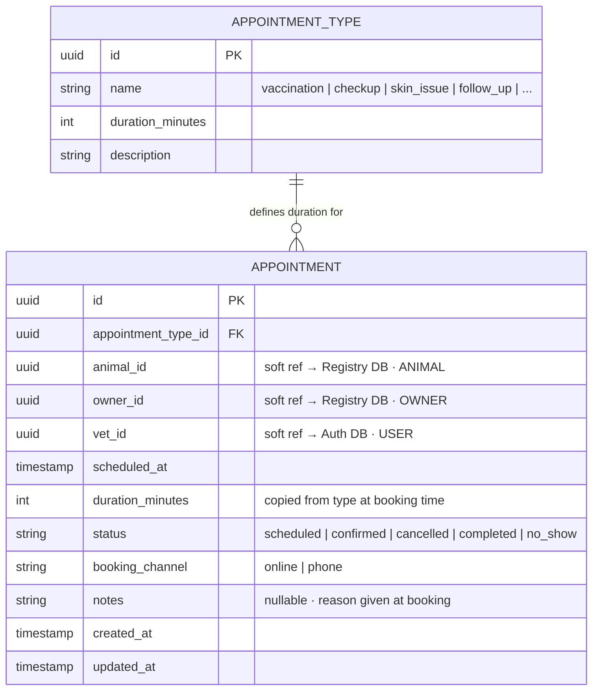
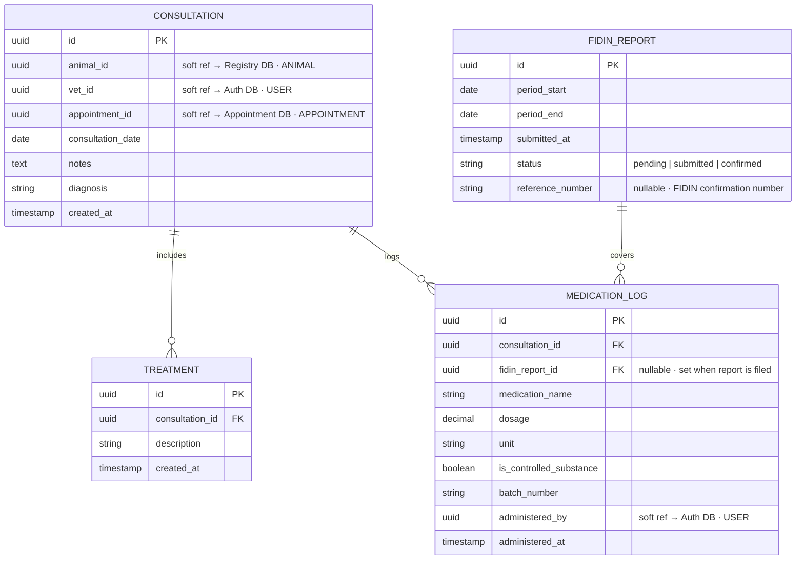
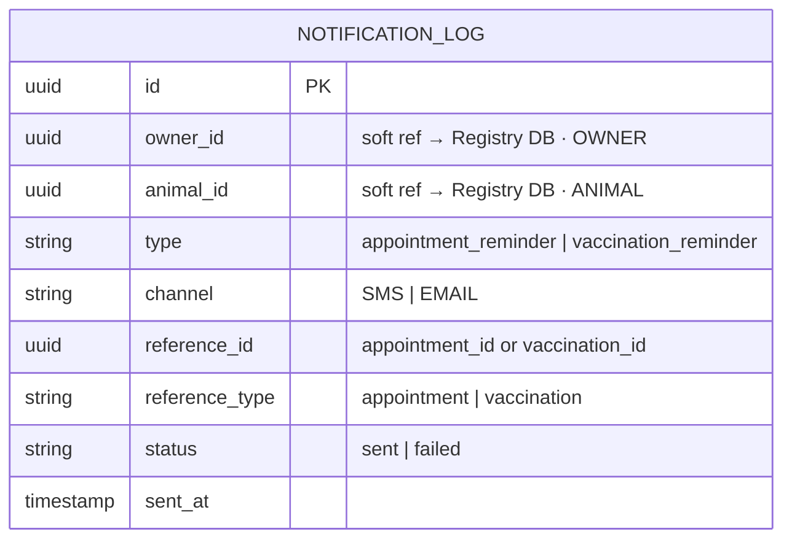

# Design Artefacts

**Veterinary Practice Information System — Dierenkliniek De Vries**

| **Document type** | Design artefacts |
| --- | --- |
| **Scope** | Must-Have requirements only (FR-01–FR-10, NFR-01–NFR-06) |
| **Linked document** | [requirements.md](requirements.md) |

---

## Use-Case Diagram — Must-Have Requirements

> Preview with `Ctrl+Shift+V` (VSCode Markdown Preview). Mermaid is built into VSCode — no extension required.
>
> **Legend:** Solid arrows = actor association · Dashed arrows = `«include»` or `«extend»` · Blue = practice staff · Red = external actors

> **Must-Have NFR constraints** (apply system-wide, not shown as use cases)
>
> | ID | Constraint |
> | --- | --- |
> | NFR-01 | GDPR / AVG compliance, EU data residency, signed DPA |
> | NFR-02 | ≥ 99.9 % availability during opening hours (Mon–Sat 08:00–18:00) |
> | NFR-03 | Response time ≤ 2 s at p95 under normal load (≤ 10 concurrent users) |
> | NFR-04 | TLS 1.2+ with mutual certificate authentication (lab connection) |
> | NFR-05 | Static IP or VPN gateway for Laboratorium Centraal access |
> | NFR-06 | Role-based access control on all patient and client records |

---

## Actor overview

| Actor | Type | Use cases |
| --- | --- | --- |
| **Client (Pet Owner)** | Primary | UC01 — online booking · UC05 — appointment reminder · UC06 — vaccination reminder |
| **Receptionist** | Primary | UC02 — phone booking · UC07 — unified client record |
| **Veterinarian** | Primary | UC07 — unified client record · UC08 — log controlled substance |
| **Veterinary Assistant** | Primary | UC08 — log controlled substance |
| **FIDIN** | External | receives UC09 — FIDIN compliance report |
| **VetBase** | External (legacy) | source for UC10 — data migration |

---

## Use-case descriptions

### UC01 — Book Appointment Online `[FR-01]`
| | |
| --- | --- |
| **Actor** | Client |
| **Precondition** | Client has access to the booking interface |
| **Main flow** | Client selects a date and preferred vet → system presents available slots → client selects a slot → **UC03** (select type & duration) → **UC04** (validate availability) → system confirms booking |
| **Postcondition** | Appointment recorded; confirmation sent to client (FR-16, Should) |

### UC02 — Book Appointment by Phone `[FR-02]`
| | |
| --- | --- |
| **Actor** | Client (initiator), Receptionist (operator) |
| **Precondition** | Client calls during opening hours |
| **Main flow** | Receptionist opens scheduling view → checks available slots → **UC03** → **UC04** → enters booking on behalf of client |
| **Postcondition** | Appointment recorded; both booking channels share the same availability state |

### UC03 — Select Appointment Type & Duration `[FR-03]`
| | |
| --- | --- |
| **Actor** | Client (online) / Receptionist (phone) |
| **Included by** | UC01, UC02 |
| **Main flow** | System presents appointment type list (vaccination, check-up, skin issue, follow-up, …) → actor selects type → system looks up predefined duration for that type → slot length is fixed |

### UC04 — Validate Slot Availability `[FR-04]`
| | |
| --- | --- |
| **Actor** | System (automated) |
| **Included by** | UC01, UC02 |
| **Main flow** | System checks selected slot across all booking channels → if free, reserves slot with optimistic lock → if taken, returns conflict and presents next available slot |
| **Postcondition** | No double booking is created regardless of concurrent access |

### UC05 — Receive Appointment Reminder `[FR-05, FR-06]`
| | |
| --- | --- |
| **Actor** | Client |
| **Trigger** | System job runs at configured interval before appointment date |
| **Main flow** | System identifies upcoming appointments → sends plain-language SMS (primary) or email (secondary) to client |

### UC06 — Receive Vaccination Due Reminder `[FR-05, FR-06]`
| | |
| --- | --- |
| **Actor** | Client |
| **Trigger** | System job runs at configured interval before vaccination due date |
| **Main flow** | System queries patient records for due vaccinations → sends plain-language SMS (primary) or email (secondary) |

### UC07 — View Unified Client Record `[FR-07]`
| | |
| --- | --- |
| **Actors** | Receptionist, Veterinarian |
| **Precondition** | User is authenticated with receptionist or vet role (NFR-06) |
| **Main flow** | User searches by client name or animal chip number → system returns single-screen view showing: contact details, animals, appointment history, patient records, outstanding invoices |

### UC08 — Log Controlled Substance Use `[FR-08]`
| | |
| --- | --- |
| **Actors** | Veterinarian, Veterinary Assistant |
| **Precondition** | User is authenticated with vet or assistant role (NFR-06) |
| **Main flow** | User opens patient record → selects administered controlled substance, quantity, and batch → system records entry with timestamp and user identity → **UC09** (extend) if monthly FIDIN threshold is reached or reporting period closes |

### UC09 — Submit FIDIN Compliance Report `[FR-08]`
| | |
| --- | --- |
| **Actor** | System (automated), FIDIN (receiver) |
| **Extends** | UC08 (on monthly reporting cycle) |
| **Main flow** | System aggregates controlled substance log for the reporting period → formats FIDIN-compliant report → submits to FIDIN → records submission confirmation |

### UC10 — Migrate Data from VetBase `[FR-09]`
| | |
| --- | --- |
| **Actor** | System / Admin (one-time activity) |
| **Main flow** | Extract all records from VetBase → **UC11** (resolve patient identifiers) → transform to new data model → import → run reconciliation report comparing record counts and checksums |
| **Postcondition** | Zero data loss confirmed; VetBase decommissioned |

### UC11 — Resolve Patient Identifiers `[FR-10]`
| | |
| --- | --- |
| **Actor** | System |
| **Included by** | UC10; also invoked at runtime during UC07 and lab result linking |
| **Main flow** | System maintains a mapping table: microchip number ↔ internal record ID ↔ lab accession number → any inbound reference (booking, lab result, reminder) is resolved to the canonical animal record |

---

## Component Diagram — Microservice Architecture

> Preview with `Ctrl+Shift+V`. Each domain service owns its own database; no shared data stores.
>
> **Legend:** Solid arrows = synchronous REST call · Dashed arrows = cron-driven internal call · Cylinder = database · Red = external system

```mermaid
flowchart TB
    classDef client   fill:#E8F8F5,stroke:#1ABC9C,color:#000
    classDef gateway  fill:#EBF5FB,stroke:#2E86C1,color:#000
    classDef service  fill:#FAFAFA,stroke:#555555,color:#000
    classDef db       fill:#FEF9E7,stroke:#B7950B,color:#000
    classDef external fill:#FADBD8,stroke:#C0392B,color:#000

    %% ── Clients ───────────────────────────────────────────────────────
    Browser["🌐 Browser / Mobile App"]:::client
    Phone["📞 Receptionist\n(phone intake)"]:::client

    %% ── Gateway layer ─────────────────────────────────────────────────
    subgraph GW["Gateway Layer"]
        Gateway["API Gateway\nrouting · rate limiting · JWT check"]:::gateway
        Auth["Auth Service\nJWT issue · RBAC · user store"]:::gateway
    end

    %% ── Domain services ───────────────────────────────────────────────
    subgraph DOMAIN["Domain Services"]
        RegistrySvc["Registry Service\nowners · animals · vaccinations · identifiers"]:::service
        ApptSvc["Appointment Service\nslots · booking · availability"]:::service
        MedSvc["Medical Record Service\nnotes · treatments · FIDIN reporting"]:::service
        NotifSvc["Notification Service\ncron-triggered · reminder dispatch"]:::service
    end

    %% ── Databases ─────────────────────────────────────────────────────
    RegistryDB[("Registry DB")]:::db
    ApptDB[("Appointment DB")]:::db
    MedDB[("Medical Record DB")]:::db

    %% ── External systems ──────────────────────────────────────────────
    SMS["📱 SMS Provider"]:::external
    EmailProv["📧 Email Provider"]:::external
    FIDIN["🏛 FIDIN\ncontrolled substances"]:::external
    VetBase["💾 VetBase\nlegacy — migration source"]:::external

    %% ── Client → Gateway ──────────────────────────────────────────────
    Browser --> Gateway
    Phone   --> Gateway

    %% ── Gateway → Auth (every request) ────────────────────────────────
    Gateway -- "validate JWT" --> Auth

    %% ── Gateway → Domain services (REST) ──────────────────────────────
    Gateway -- "REST" --> RegistrySvc
    Gateway -- "REST" --> ApptSvc
    Gateway -- "REST" --> MedSvc

    %% ── Unified client view: gateway aggregates two services ───────────
    Gateway -. "aggregate:\nunified client view FR-07" .-> RegistrySvc
    Gateway -. "aggregate:\nunified client view FR-07" .-> ApptSvc

    %% ── Services → own databases ──────────────────────────────────────
    RegistrySvc --- RegistryDB
    ApptSvc     --- ApptDB
    MedSvc      --- MedDB

    %% ── Notification service (cron, not exposed via gateway) ──────────
    NotifSvc -. "poll owners · animals\n& due dates FR-05, FR-06" .-> RegistrySvc
    NotifSvc -. "poll upcoming\nappointments FR-05" .-> ApptSvc
    NotifSvc -- "send SMS\nFR-06" --> SMS
    NotifSvc -- "send email\nFR-06" --> EmailProv

    %% ── Medical record service → FIDIN ────────────────────────────────
    MedSvc -- "monthly report\nFR-08" --> FIDIN

    %% ── One-time data migration ───────────────────────────────────────
    VetBase -. "one-time\nmigration FR-09" .-> RegistrySvc
    VetBase -. "one-time\nmigration FR-09" .-> ApptSvc
    VetBase -. "one-time\nmigration FR-09" .-> MedSvc
```

### Service responsibilities at a glance

| Service | Owns | Talks to | FR |
| --- | --- | --- | --- |
| **API Gateway** | Routing, rate limiting, JWT validation, unified-view aggregation | Auth Service + all domain services | FR-04, FR-07 |
| **Auth Service** | JWT issuance, user accounts, roles (vet / assistant / receptionist / admin) | — | NFR-06 |
| **Registry Service** | Owner profiles, animal records, vaccination history, patient identifier mapping | Registry DB | FR-07, FR-10 |
| **Appointment Service** | Slot definitions per type, availability calendar, double-booking lock | Appointment DB | FR-01, FR-02, FR-03, FR-04 |
| **Medical Record Service** | Consultation notes, medication logs, monthly FIDIN report generation | Medical Record DB · FIDIN | FR-07, FR-08 |
| **Notification Service** | Cron jobs for appointment and vaccination reminders, SMS/email dispatch | Registry Svc · Appt Svc · SMS Provider · Email Provider | FR-05, FR-06 |

---

## Entity-Relationship Diagrams

> One diagram per service database. Each service owns its schema exclusively — there are no shared tables and no cross-database foreign key constraints.
> Fields marked `"soft ref"` are plain UUIDs stored locally; referential integrity across service boundaries is the application's responsibility, not the database's.

---

### Auth DB

---

### Registry DB

---

### Appointment DB

---

### Medical Record DB

---

### Notification DB

---

### Cross-service soft references

Fields stored as a plain UUID with no database-enforced foreign key. Consistency is maintained at the application level.

| Field | Table · Service | References | Table · Service |
| --- | --- | --- | --- |
| `administered_by` | VACCINATION · Registry DB | USER.id | Auth DB |
| `animal_id` | APPOINTMENT · Appointment DB | ANIMAL.id | Registry DB |
| `owner_id` | APPOINTMENT · Appointment DB | OWNER.id | Registry DB |
| `vet_id` | APPOINTMENT · Appointment DB | USER.id | Auth DB |
| `animal_id` | CONSULTATION · Medical Record DB | ANIMAL.id | Registry DB |
| `vet_id` | CONSULTATION · Medical Record DB | USER.id | Auth DB |
| `appointment_id` | CONSULTATION · Medical Record DB | APPOINTMENT.id | Appointment DB |
| `administered_by` | MEDICATION_LOG · Medical Record DB | USER.id | Auth DB |
| `owner_id` | NOTIFICATION_LOG · Notification DB | OWNER.id | Registry DB |
| `animal_id` | NOTIFICATION_LOG · Notification DB | ANIMAL.id | Registry DB |
